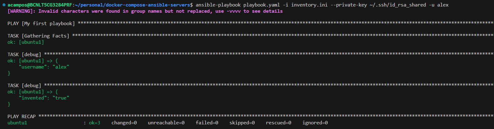

# Rady Ansible Servers using Docker Compose

## Contents

## 1. Introduction

In this project we will run using docker-compose a few servers ready to play with using Ansible. The way we have configured the image and the servers from scratch is in the following [GitHub Project - SSH docker container](https://github.com/titocampis/ssh-docker-container)

## 2. Docker Compose File
We have configured 3 services:
- `ubuntu1`: ubuntu:latest image with ssh service configured
- `ubuntu2`: ubuntu:latest image with ssh service configured
- `ubuntu3`: centos:7 image with ssh service configured

> :paperclip: **NOTE:** Before build the docker image, you should pull it as sudo:
>```bash
>sudo docker pull centos:7
>```
> :paperclip: **NOTE2:** To build a docker image using a different file:
>```bash
>docker build -t centos:ssh . -f <file-name>
>```

We have configured a secret to pass into the containers our `id_rsa.pub` public key:
```yaml
secrets:
  user_ssh_rsa:
    file: ~/.ssh/id_rsa.pub
```

We have choosen the `~/.ssh/id_rsa.pub` because by default, ssh check the following keys:
- `~/.ssh/id_ecdsa`
- `~/.ssh/id_ecdsa_sk`
- `~/.ssh/id_ed25519`
- `~/.ssh/id_ed25519_sk`
- `~/.ssh/id_xmss`
- `~/.ssh/id_xmss`
- `~/.ssh/id_dsa`
- `~/.ssh/id_rsa`

But we can choose any key we have until it is not named as default name, using `--private-key`:
```bash
ansible-playbook playbook.yaml -i inventory.ini --private-key ~/.ssh/id_rsa_shared
```


The user configured inside the server is `alex`, you can check it into the [Dockerfile](Dockerfile). So by default, if no `username` is passed to ssh, it tries to stablish the connection with your local linux user. So to run the playbooks on any machine regardless the `username` you can user the flag `-u my_username`
```bash
ansible-playbook playbook.yaml -i inventory.ini -u jiminycricket
```

## 3. Start the 3 Services
### 3.1 Start just one server 
To start just one server, we have to tell docker-compose to run only one of the services:
```bash
docker compose up -d ubuntu1
```

### 3.2 Start a couple of servers
```bash
docker compose up -d ubuntu1 ubuntu2
```

### 3.3 Start all the servers
```bash
docker compose up -d
```

### 3.3 Stop all the servers
```bash
docker compose down
```

# 4. Ansible